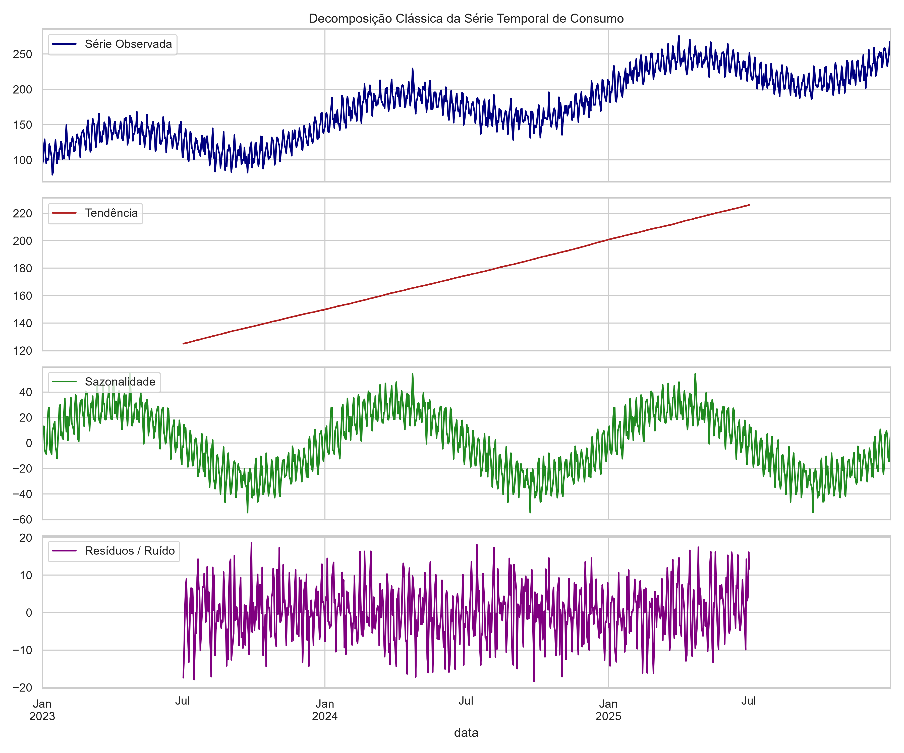
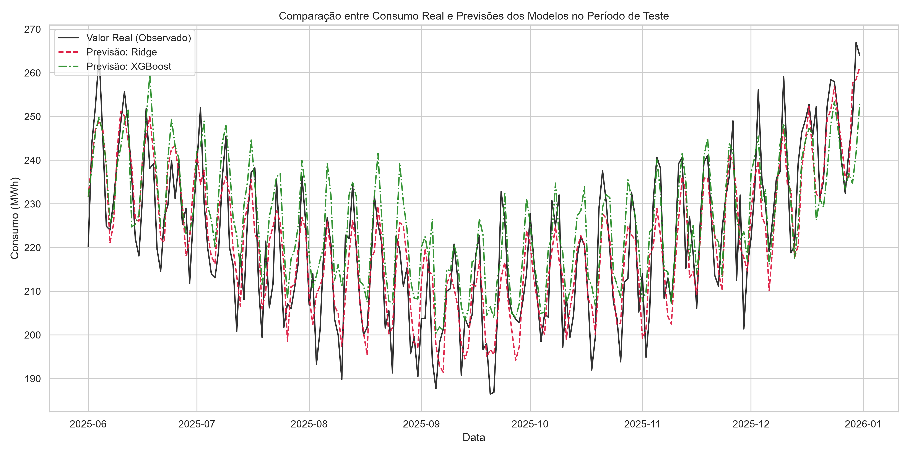

# ⚡ Previsão de Demanda de Energia Elétrica: Séries Temporais e Regressão Avançada

Este projeto apresenta uma abordagem quantitativa e preditiva para modelagem e previsão do consumo diário de energia elétrica, combinando técnicas estatísticas de análise de séries temporais e modelos de Machine Learning.

## 🎯 Objetivos do Projeto
- Realizar a **Análise Exploratória de Dados (EDA)** e decomposição temporal em componentes de tendência, sazonalidades (anual e semanal) e ruído estocástico.
- Validar as propriedades de estacionariedade da série temporal por meio do **Teste de Dickey-Fuller Aumentado (ADF)**.
- Transformar a série em um problema de aprendizado supervisório por meio da **Engenharia de Features** (*lags*, estatísticas móveis e variáveis calendáricas).
- Treinar e comparar a performance preditiva entre modelos lineares regularizados (**Regressão Ridge**) e modelos de *Gradient Boosting* (**XGBoost**).

---

## 🔬 Metodologia e Modelagem Matemático-Estatística

### 1. Decomposição Temporal
A série temporal $y_t$ foi formulada de forma aditiva:
$$y_t = T_t + S^{\text{anual}}_t + S^{\text{semanal}}_t + \epsilon_t$$

Onde $\epsilon_t \sim \mathcal{N}(0, \sigma^2)$ representa a flutuação estocástica do sistema.



### 2. Teste de Estacionariedade
- **Estatística ADF**: $-0.5651$
- **p-valor**: $0.8786$ ($> 0.05$)
- **Conclusão**: Confirmação da não-estacionariedade da série original devido à presença de tendência determinística crescente.

---

## 📈 Resultados e Comparação de Modelos

A avaliação dos modelos foi realizada no conjunto de teste (20% finais do histórico temporal) utilizando as métricas **RMSE**, **MAE** e **MAPE**:

| Modelo | RMSE (MWh) | MAE (MWh) | MAPE (%) |
| :--- | :---: | :---: | :---: |
| **Regressão Ridge** | **8.651** | **7.130** | **3.25%** |
| **XGBoost Regressor** | 10.962 | 8.794 | 4.07% |



### Principais Conclusões:
1. A **Regressão Ridge** apresentou o melhor desempenho geral ($MAPE = 3.25\%$), atingindo um limite de erro próximo à variância do ruído intrínseco do sistema ($\sigma = 8.0$).
2. O modelo **XGBoost** demonstrou limitação típica no acompanhamento de tendências lineares contínuas sem a aplicação prévia de diferenciação na série.

---

## 🛠️ Tecnologias e Bibliotecas Utilizadas
- **Linguagem**: Python 3.x
- **Análise de Dados**: `pandas`, `numpy`
- **Análise Estatística**: `statsmodels`
- **Machine Learning**: `scikit-learn`, `xgboost`
- **Visualização**: `matplotlib`, `seaborn`

---

## 💻 Como Executar o Projeto

1. Clone o repositório:
   ```bash
   git clone [https://github.com/mmarianaa/previsao-series-temporais-energia.git](https://github.com/mmarianaa/previsao-series-temporais-energia.git)
   cd previsao-series-temporais-energia